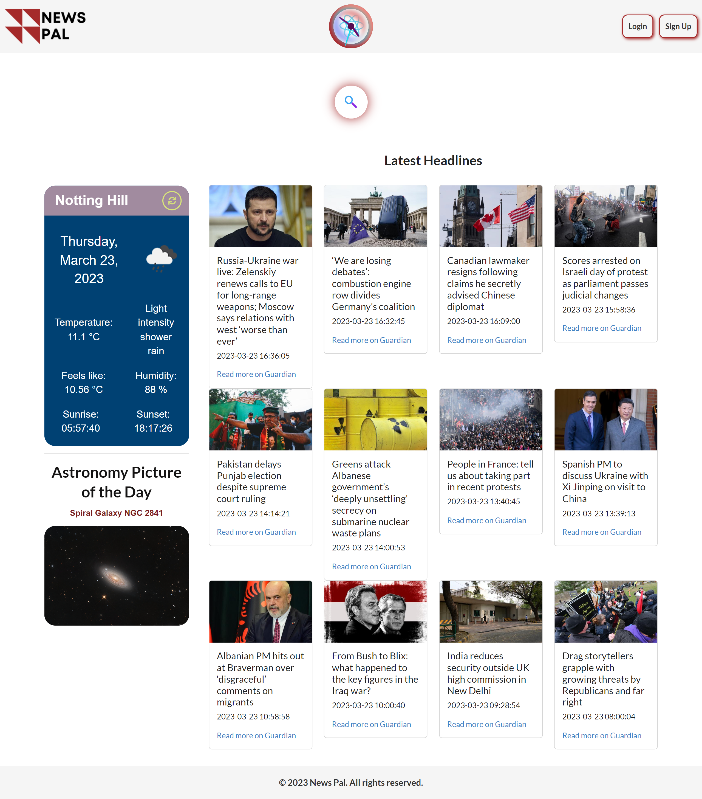
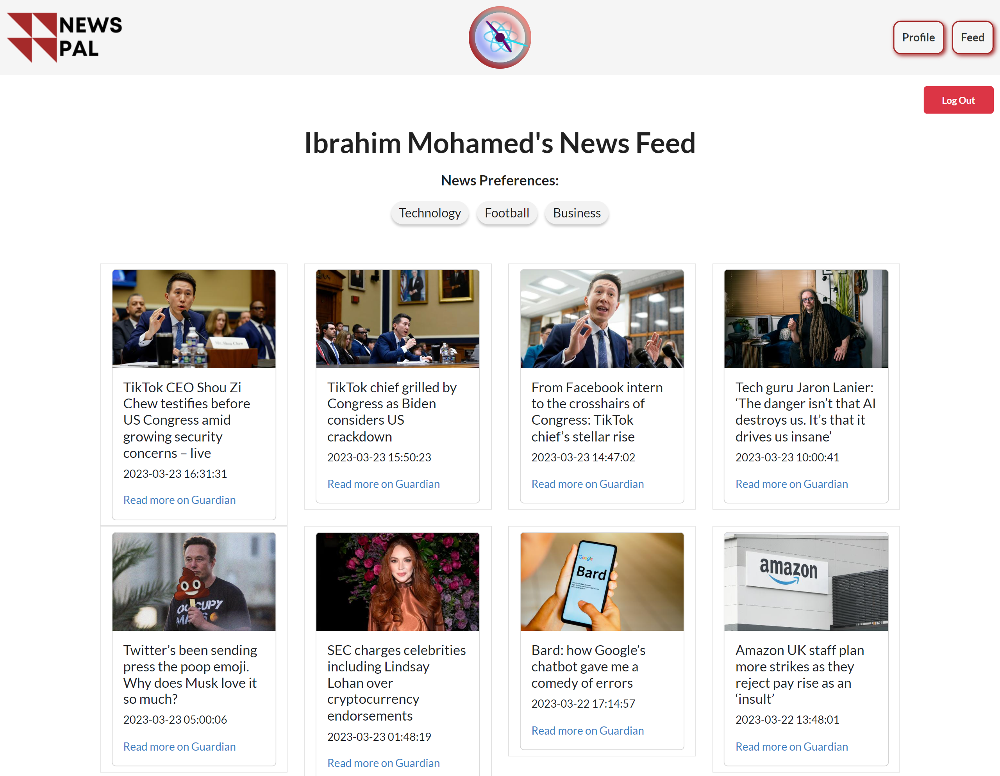

# News Pal

## Description

News Pal is a news application that is the ultimate tool for busy individuals who want to stay informed while saving time and money. With customizable news feeds, a reputable news source, and a completely free platform, they can stay up-to-date with the world without breaking the bank or sacrificing precious time.  It combines data from The Guardian Open Platform, OpenWeather and Nasa API to provide accurate information.

### Built with:


## User Story

```text
As A busy professional
I WANT a news application that can provide me with relevant, high-quality news coverage
SO THAT I have quick access to a relevant news feed as well as latest headlines
```

## Table of Contents
- [Installation](#Installation)
- [Usage](#Usage)
- [Live Website](#Live-Website)
- [Questions](#Questions)
- [Credits](#Credits)
- [Contributing](#Contributing)
- [License](#License)

## Installation
### To install the application:
1. Clone the repo
```
git clone https://github.com/aboltins/News-Pal.git
cd News-Pal
```
2. Install NPM packages
```
npm install
```

## Usage
The application is invoked by entering the following command on your terminal:
```
npm start
```

## Live Website

The live website can be found here: <a href="https://newspal.netlify.app/" target="_blank"> News Pal</a>

### The live website looks like this:
<br/>
<h2>Home page:</h2>

<br/>
<h2>News Feed page:</h2>


## Questions
Contact us if you have any questions!
<br/>
Ibrahim:
- Drop me an email [ibrahim.mohamed1218@gmail.com](mailto:ibrahim.mohamed1218@gmail.com)
- Check out my GitHub profile [Ibrahim-Mohamed45](https://github.com/Ibrahim-Mohamed45)
<br/>
<p>Arturs:</p>

- Drop me an email [arthuraboltins@gmail.com](mailto:arthuraboltins@gmail.com)
- Check out my GitHub profile [aboltins](https://github.com/aboltins)
<br/>
<p>Elena:</p>

- Drop me an email [coralpeony21@gmail.com](mailto:coralpeony21@gmail.com)
- Check out my GitHub profile [coralpeony](https://github.com/coralpeony)


## Credits
- <a href="https://open-platform.theguardian.com/" target="_blank"> Guardian API</a>
- <a href="https://openweathermap.org/api" target="_blank"> Open Weather API</a>
- <a href="https://api.nasa.gov/" target="_blank"> Nasa API</a>
- <a href="https://momentjs.com/" target="_blank"> Moment JS</a>
- <a href="https://www.netlify.com/" target="_blank"> Netlify</a>


## Contributing
Contributions are what make the open source community such an amazing place to learn, inspire, and create. Any contributions you make are **greatly appreciated**.
Contributions are what make the open source community such an amazing place to learn, inspire, and create. Any contributions you make are greatly appreciated.

If you have a suggestion that would make this better, please fork the repo and create a pull request. You can also simply open an issue with the tag "enhancement".

1. Fork the Project
2. Create your Feature Branch (```git checkout -b feature/AmazingFeature```)
3. Commit your Changes (```git commit -m 'Add some AmazingFeature'```)
4. Push to the Branch (```git push origin feature/AmazingFeature```)
5. Open a Pull Request

## License
This project is licensed under the terms of the **MIT License**. See [LICENSE](LICENSE) for more information.